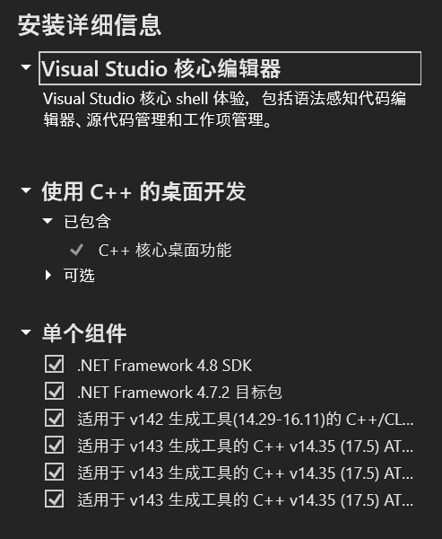

大模型相关的常见package在***Windows***上的安装方案。在以下配置上已测试成功: ```windows11 + python3.11 + cuda12.3 + cudnn8.9.5.30 + torch2.1.0+cu121 + ninja1.11.1 + cmake3.28.0-rc5 + Visual Studio 2022```

## 0. Prerequisite
#### a. 确认NVIDIA GPU架构
可根据下图


或运行```torch.cuda.get_device_capability()```获取

#### b. 软件安装
需安装Visual Studio、ninja、cmake和CUDA

- Microsoft Visual Studio 2022安装注意事项如下，`单个组件`需勾选6个额外模块 ，[参考链接](https://blog.csdn.net/feking2/article/details/130160845)：



- 安装顺序：必须先安装Visual Studio，再安装CUDA

## 1. apex
目前为止没有成功

## 2. cutlass
打开Git Bash
```bash
# 设定环境变量
export CUDACXX=/c/Program\ Files/NVIDIA\ GPU\ Computing\ Toolkit/CUDA/v12.3/bin/nvcc

git clone https://github.com/NVIDIA/cutlass.git
mkdir build && cd build

# 显卡架构的数字根据自己情况修改
cmake .. -DCUTLASS_NVCC_ARCHS=89 -DCUTLASS_ENABLE_TESTS=OFF -DCUTLASS_ENABLE_LIBRARY=OFF -DCUTLASS_UNITY_BUILD_ENABLED=ON
cmake --build . --config Release -j 8
```

## 3. flash attention
打开Git Bash
```bash
git clone https://github.com/Dao-AILab/flash-attention.git
cd flash-attention
# IMPORTANT: do not manually copy cmake-built (or incorrect version?) cutlass code to flash-attention/csrc/cutlass
MAX_JOBS=8 python setup.py install
```

## 4. xformers
打开任意终端，如：cmd、powershell或git bash
```cmd
pip3 install -U xformers --index-url https://download.pytorch.org/whl/cu121
```

## 5. deepspeed
打开Git Bash
```bash
git clone https://github.com/microsoft/DeepSpeed.git
cd deepspeed
rm -rf build
# 显卡架构的数字根据自己情况修改
TORCH_CUDA_ARCH_LIST=8.9 DS_BUILD_OPS=0 DS_BUILD_AIO=0 DS_BUILD_CCL_COMM=1 DS_BUILD_CPU_ADAM=1 DS_BUILD_CPU_ADAGRAD=1 DS_BUILD_TRANSFORMER=1 DS_BUILD_TRANSFORMER_INFERENCE=0 DS_BUILD_INFERENCE_CORE_OPS=0 DS_BUILD_CUTLASS_OPS=0 python setup.py build_ext -j8 bdist_wheel 2>&1 | tee build.log
# 完成后会在dist目录生成whl文件
pip install dist/deepspeed-0.12.4+a3926bbb-cp311-cp311-win_amd64.whl
```


