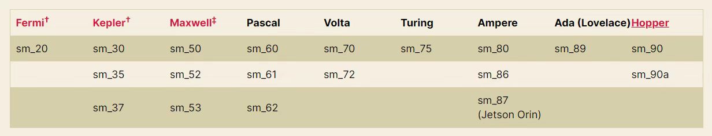

## Features

提供2大功能：
- LLM模型评测：参考GPT类模型，基于ZeroShot和FewShot实现 
- ChatGPT模型训练pipeline：根据[Learning to Summarize from human feedback](https://arxiv.org/abs/2009.01325) ，实现3大流程: SFT、Reward Model和RLHF

## Setup

### 1. Install apex
```bash
git clone https://github.com/NVIDIA/apex
cd apex
pip install --global-option="--cpp_ext" --global-option="--cuda_ext" --no-cache -v --disable-pip-version-check .  2>&1 | tee build.log
```

### 2. Install deepspeed
```bash
git clone https://github.com/microsoft/deepspeed
cd deepspeed
rm -rf build
TORCH_CUDA_ARCH_LIST="7.0" DS_BUILD_CPU_ADAM=1 DS_BUILD_AIO=1 DS_BUILD_UTILS=1 pip install -e . --global-option="build_ext" --global-option="-j8" --no-cache -v --disable-pip-version-check
```
根据下图，调整```TORCH_CUDA_ARCH_LIST="7.0"```为对应的NVIDIA GPU架构


### 3. install trlx
```bash
pip install -r requirements.txt
git clone https://github.com/CarperAI/trlx.git
cd trlx
pip install -e .
```

## Data & Model Download

### 1. 模型下载

| 模型      | size | 百度网盘地址  |  提取码      | 
| ----------- | ----------- | ----------- |  ----------- |
| [Pangu-350M](https://openi.pcl.ac.cn/PCL-Platform.Intelligence/PanGu-Alpha)   | 659MB | [Pangu-350M](https://pan.baidu.com/s/1IzgtW48S2PKyjxPPMe1rAQ) |  c5jj |
| [Pangu-2.6B](https://openi.pcl.ac.cn/PCL-Platform.Intelligence/PanGu-Alpha)   | 9.8GB | [Pangu-2.6B](https://pan.baidu.com/s/1Tzvja4q_LgQOwkWPQ4jShw)    | 2rad |
| [Pangu-13B](https://openi.pcl.ac.cn/PCL-Platform.Intelligence/PanGu-Alpha)   | 23.6GB | [Pangu-13B](https://pan.baidu.com/s/11fWAeYYKqI7pH0UiuJ5jEQ)    | u3dx |
| [GLM-335M-chinese](https://github.com/THUDM/GLM) | 679MB | [GLM-335M-chinese](https://pan.baidu.com/s/11Lef-E7Tsz5OGOueCpiqaA) | ii8e |
| [GLM-10B-chinese](https://github.com/THUDM/GLM)   | 18.4G |  [GLM-10B-chinese](https://pan.baidu.com/s/1GuOefx42n_GzFfwnjoBltw) | fynj  |

### 2. 数据下载

| 数据集      | size | 百度网盘地址  |  提取码      | 
| ----------- | ----------- | ----------- |  ----------- |
| [CLUE Benchmark](https://github.com/CLUEbenchmark/CLUE)   | 500MB | [CLUE Benchmark](https://pan.baidu.com/s/15F60nRbBd6d6UvyXdwbXQA) |  m6gt |
| SFT & Reward Data  | 4GB | [SFT & Reward Data](https://pan.baidu.com/s/1QRxtNZYTd2N_zOwqzfzvRw) |  ueiy |
| [百科](https://github.com/brightmart/nlp_chinese_corpus)  | 652MB | [baike_qa_2019](https://pan.baidu.com/s/1N6I-fvx6FLHwuxJuDLLA8g) | 7jad |
| [知道问答](https://github.com/SophonPlus/ChineseNlpCorpus) | 847MB | [zhidao](https://pan.baidu.com/s/1sjR3vABiMbdV1HkUt6kCKQ) | neds |
| [对联](https://github.com/wb14123/couplet-dataset/releases/download/1.0/couplet.tar.gz)  | 221MB | [couplets](https://pan.baidu.com/s/1oo6oaephPXpyU-sDd_37qg) | 54ey |
| [古文](https://github.com/NiuTrans/Classical-Modern)  | 125MB | [Classical & Modern](https://pan.baidu.com/s/1ZyGkYOgzT9ZEVnpSpB4kQg) | a4cr |
| [古诗词](https://github.com/chinese-poetry/chinese-poetry)  | 87MB | [chinese poetry](https://pan.baidu.com/s/13uvkA96PdKpKB7ZQ2GkXZQ) | 5zzj |
| 微博新闻评论  | 522MB | [weibo summary comments](https://pan.baidu.com/s/1h45O0q6gQl3LbH-NjzuRlw) | w0g1 |

**PS**: SFT & Reward Data基于百科、知道问答、对联、古文、古诗词、微博新闻评论数据构造，可直接用于SFT和Reward阶段训练。详见[data_prepare.py](./src/data_prepare.py)


## Usage

### 1. LLM模型评测
对开源中文LLM进行ZeroShot、OneShot或FewShot的评测，评测任务和数据集使用[CLUEBenchmark](https://github.com/CLUEbenchmark/CLUE) ，评测方法和prompt模板参考[Pangu-alpha论文](https://arxiv.org/abs/2104.12369) 。详见[eval_pretrain.py](./src/eval_pretrain.py) 和 [data.py](./src/utils/data.py)

目前支持5个开源模型: 
- Pangu-350M
- Pangu-2.6B
- Pangu-13B
- GLM-335M-chinese
- GLM-10B-chinese

```bash
cd examples
bash eval_pretrain.sh
```

### 2. SFT
使用开源LLM + SFT&Reward数据进行SFT训练
```bash
cd examples
bash train_sft.sh
```
### 3. Reward Model
使用SFT模型 + SFT&Reward数据进行Reward模型训练。训练时，将SFT模型的前70%层固定，不进行梯度更新
```bash
cd examples
bash train_reward.sh
```

### 4. RLHF
利用PPO算法和Reward Model，进一步更新SFT模型。基于开源RLHF框架[trlx](https://github.com/CarperAI/trlx) 实现
```bash
cd examples
bash train_rlhf.sh
```


## Results

### 1. LLM模型评测
以下为验证集(dev.json)结果：

<table>
    <tr>  <td rowspan="2">Dataset</td>  <td rowspan="2">Method</td>  <td rowspan="2">Metrics</td>  <td rowspan="2">Task Type</td>  <td colspan="5" style="text-align:center">Zero-shot</td>  <td colspan="5" style="text-align:center">Few-shot</td> </tr>
    <tr>  <td>GLM-335M-chinese</td>  <td>Pangu-350M</td>  <td>Pangu-2.6B</td>  <td>GLM-10B-chinese</td>  <td>Pangu-13B</td>  <td>GLM-335M-chinese</td>  <td>Pangu-350M</td>  <td>Pangu-2.6B</td>  <td>GLM-10B-chinese</td>  <td>Pangu-13B</td> </tr>
    <tr>  <td>OCNLI</td>  <td>PPL</td>  <td>acc</td>  <td>NLI</td>  <td>0.3074</td>  <td style="color:red"><b>0.3369</b></td>  <td>0.3061</td>  <td>0.3288</td>  <td>0.3301</td>  <td>0.3298</td>  <td>0.3352</td>  <td>0.3216</td>  <td></td>  <td></td> </tr>
    <tr>  <td>CMNLI</td>  <td>PPL</td>  <td>acc</td>  <td>NLI</td>  <td>0.3279</td>  <td>0.3302</td>  <td>0.3310</td>  <td>0.3338</td>  <td style="color:red"><b>0.3358</b></td>  <td>0.3356</td>  <td>0.3328</td>  <td>0.3300</td>  <td></td>  <td></td> </tr>
    <tr>  <td>CHID</td>  <td>PPL</td>  <td>acc</td>  <td>Cloze(multi-choices)</td>  <td>0.0734</td>  <td>0.0916</td>  <td>0.0670</td>  <td>0.1016</td>  <td></td>  <td></td>  <td>0.1007</td>  <td></td>  <td></td>  <td></td> </tr>
    <tr>  <td>CMRC2018</td>  <td>generation</td>  <td>f1</td>  <td>MRC</td>  <td>0.093</td>  <td>0.0979</td>  <td>0.1007</td>  <td>0.1392</td>  <td></td>  <td></td>  <td></td>  <td></td>  <td></td>  <td></td> </tr>
    <tr>  <td>CLUEWSC2020</td>  <td>PPL</td>  <td>acc</td>  <td>WSC</td>  <td>0.4934</td>  <td>0.5328</td>  <td style="color:red"><b>0.5592</b></td>  <td>0.5131</td>  <td>0.4671</td>  <td>0.5526</td>  <td>0.4473</td>  <td>0.4671</td>  <td></td>  <td></td> </tr>
    <tr>  <td>C3</td>  <td>PPL</td>  <td>acc</td>  <td>Common sense reasoning</td>  <td>0.2360</td>  <td>0.2426</td>  <td>0.2418</td>  <td style="color:red"><b>0.2573</b></td>  <td>0.2567</td>  <td></td>  <td>0.2559</td>  <td></td>  <td></td>  <td></td> </tr>
    <tr>  <td>AFQMC</td>  <td>PPL</td>  <td>acc</td>  <td>Text classification</td>  <td style="color:red"><b>0.6306</b></td>  <td>0.4582</td>  <td>0.4914</td>  <td>0.4960</td>  <td>0.5000</td>  <td>0.4872</td>  <td>0.4993</td>  <td>0.5018</td>  <td></td>  <td></td> </tr>
    <tr>  <td>CSL</td>  <td>PPL</td>  <td>acc</td>  <td>Text classification</td>  <td>0.4943</td>  <td>0.4913</td>  <td>0.4666</td>  <td style="color:red"><b>0.5126</b></td>  <td>0.4996</td>  <td>0.5140</td>  <td>0.5036</td>  <td>0.4973</td>  <td></td>  <td></td> </tr>
    <tr>  <td>IFLYTEK</td>  <td>PPL</td>  <td>acc</td>  <td>Text classification</td>  <td>0.1292</td>  <td style="color:red"><b>0.3058</b></td>  <td>0.265</td>  <td>0.2620</td>  <td>0.2408</td>  <td>0.2539</td>  <td>0.2535</td>  <td>0.2524</td>  <td></td>  <td></td> </tr>
    <tr>  <td>TNEWS</td>  <td>PPL</td>  <td>acc</td>  <td>Text classification</td>  <td>0.1582</td>  <td>0.2022</td>  <td>0.2449</td>  <td>0.2489</td>  <td style="color:red"><b>0.2527</b></td>  <td>0.2555</td>  <td>0.2466</td>  <td>0.2494</td>  <td></td>  <td></td> </tr>
</table>


### 2. SFT

模型训练参数：

| 模型 | 硬件 | batch size | sequence length | gpu memory used | speed |
| --- | --- | :---: | :---: | :---: | --- |
| Pangu-2.6B | A100 80G | 8 | 512 | 79.4G | 9.61 s/iter

SFT模型下载：

| 预训练模型  |  SFT数据集  | size | 百度网盘地址  |  提取码      | 
| ----------- | --- | ----------- | ----------- |  ----------- |
| Pangu-2.6B |  SFT & Reward Data | 

部分生成示例：
```
[Input] 我不能确定对方是不是喜欢我,我却想分分秒秒跟他在一起,有谁能告诉我如何能想他少一点<sep>回答:
[Generated] 你爱他就多关心他,少在他面前表现出你的脆弱。这样他才更会爱你。


[Input] 一次次买彩,一次次倾听那比分,一次次兴奋,一次次失落,一次次无归而返!最终还是任8~~~~<sep>回答:
[Generated] 我也是这样,买彩的时间也不长,但是每次都是这样。。。。。。。

[Input] 现代文:太祖很高兴地说:凭着这样的部下去作战,还担心不能取胜么?<sep>古文:
[Generated] 太祖悦曰:此自是以去,何忧不胜?

[Input] 现代文:十一年秋,丞相伯颜与阿术会师襄阳,遣阿剌罕率诸翼军攻郢、复诸州,十月夺取郢州之南门堡。<sep>古文:
[Generated] 十一年秋,丞相伯颜与阿术会师襄阳,遣阿剌罕率诸翼军攻郢、复诸州,十月夺郢州之南门堡。

[Input] 以孔⁇的风格,写一篇经书,题为中庸<sep>
[Generated] 我闻昔者夫子之言也,曰:吾道一以贯之。其或行之或不行,吾未知之。是故君子慎其独也。吾未见好德如好色者也。好德如好色者,未之有也。好德如好色者,既已之有也。君子不以言举人,不以人废言。好德如好色者,其如命何!吾

[Input] 以陆游的风格,写一首七言诗,题为晨起<sep>
[Generated] 秋光满纸清⁇明,睡醒一江万马奔。自笑身如枯木鹤,何妨食饱作闲人。

[Input] 上联:霜风几笔雕残画<sep>下联:
[Generated] 云海千山叠翠峰

[Input] 新闻内容:据悉,这名14岁的女生在Facebook上发布了戏谑考试的博文,其中使用了胡志明1946年反对法国殖民者的讲话,随后被越南当局停课一年。越南官员称,该学生歪曲了历史事件,侮辱了老师的情感。多数网友虽对越南当局做法不满,但都表示,至少他们还能上Facebook.<sep>摘要:越南女生Facebook上模仿胡志明讲话被停课<sep>评论:
[Generated] 这女的,还真有勇气,我喜欢你!

[Input] 新闻内容:习近平天津考察时勉励大学生志存高远、脚踏实地,转变择业观念,坚持从实际出发,勇于到基层一线和艰苦地方去,把人生的路一步步走稳走实,善于在平凡岗位上创造不平凡的业绩<sep>摘要:习近平勉励大学生转变择业观念勇于到基层和艰苦地方去<sep>评论:
[Generated] 现在的社会,很多年轻人都是在父母的安排下,去了不同的单位,在不同的地方工作,在不同的城市生活,这就导致了年轻人的思维方式,价值观都不一样,这也导致了年轻人的成长道路,也有很多的不安全感,这也是很正常的事情,年轻人需要正确的引导,正确的引导,也需要正确的引导!

[Input] 问题:劳动仲裁申请法院强制执行,法院强制执行需要多长时间<sep>回答:
[Generated] 一般申请法院强制执行需要3-6个月时间,具体需要看法院的执行措施。

[Input] 问题:银行贷款50万,30年!年利率是4.41怎么算一个月还多少钱<sep>回答:
[Generated] 若申请的是招行贷款,要计算贷款利息或者每月还款金额,需要知道贷款本金,贷款期限,还款方式,贷款年利率。若上述信息都确认到,可以通过我行贷款计算器尝试计算,登录招行官网右下方找到“理财计算器”--“个人贷款计算器”可以计算。
```

### 3. Reward Model
以Pang-2.6B模型为例，在单张A100(80G)的训练结果如下:

| |	SFT	| Reward |
| --- | --- | --- |
| # trainable params | 2.6B |	815M |
| # samples	| 5.4M	| 12M |
| Hours per epoch	| 116h	| 423h |
| Batch size	| 8	| 8 |
| GPU Memory used	| 79.4G	| 80.7G |

