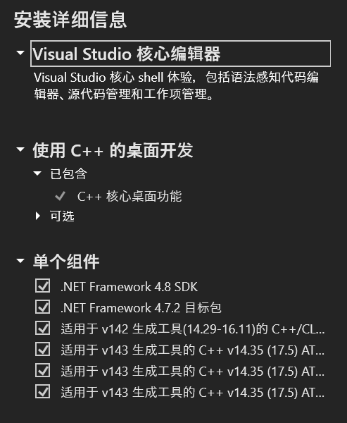

大模型相关的常见package在***Windows***上的安装方案。在以下配置上已测试成功: ```windows11 + python3.11 + cuda12.3 + cudnn8.9.5.30 + torch2.1.0+cu121 + ninja1.11.1 + cmake3.28.0-rc5 + Visual Studio 2022```

## 0. Prerequisite
#### a. 确认NVIDIA GPU架构
可根据下图


或运行```torch.cuda.get_device_capability()```获取

#### b. 软件安装
需安装Visual Studio、ninja、cmake和CUDA

- Microsoft Visual Studio 2022安装注意事项如下，`单个组件`需勾选6个额外模块 ，[参考链接](https://blog.csdn.net/feking2/article/details/130160845)：



- 安装顺序：必须先安装Visual Studio，再安装CUDA

## 1. apex
目前为止没有成功

## 2. cutlass
打开Git Bash
```bash
# 设定环境变量
export CUDACXX=/c/Program\ Files/NVIDIA\ GPU\ Computing\ Toolkit/CUDA/v12.3/bin/nvcc

git clone https://github.com/NVIDIA/cutlass.git
mkdir build && cd build

# 显卡架构的数字根据自己情况修改
cmake .. -DCUTLASS_NVCC_ARCHS=89 -DCUTLASS_ENABLE_TESTS=OFF -DCUTLASS_ENABLE_LIBRARY=OFF -DCUTLASS_UNITY_BUILD_ENABLED=ON
cmake --build . --config Release -j 8
```
在以下commit-id: `b5d8a5d9ccb435268e2215144dca162b0fc6a826`编译成功

## 3. flash attention
打开Git Bash
```bash
git clone https://github.com/Dao-AILab/flash-attention.git
cd flash-attention
# IMPORTANT: do not manually copy cmake-built (or incorrect version?) cutlass code to flash-attention/csrc/cutlass
MAX_JOBS=8 python setup.py install
```
在以下commit-id: `017716451d446e464dde9aca3a3c1ed2209caaa9`安装成功

- benchmark

  - 测试代码: https://github.com/Dao-AILab/flash-attention/blob/main/benchmarks/benchmark_flash_attention.py

  - 测试设备：单张4090

  <details>
    <summary>结果</summary>
    <table>
      <tr> <td rowspan="2" style="text-align:center">is causal</td>  <td rowspan="2" style="text-align:center">head dim</td> <td rowspan="2" style="text-align:center">batch size</td> <td rowspan="2" style="text-align:center">seq length</td> <td rowspan="2" style="text-align:center">Model</td> <td colspan="3" style="text-align:center">Speed (TFLOPS/s)</td> </tr>
      <tr> <td>fwd</td>  <td>bwd</td>  <td>fwd+bwd</td> </tr>
      <tr> <td>false</td> <td>64</td> <td>32</td> <td>512</td> <td>Flash2</td> <td>149.21</td> <td>91.05</td> <td>102.46</td> </tr>
      <tr> <td>false</td> <td>64</td> <td>32</td> <td>512</td> <td>Pytorch</td> <td>20.04</td> <td>22.91</td> <td>22.01</td> </tr>
      <tr> <td>false</td> <td>64</td> <td>32</td> <td>512</td> <td>xformers.cutlass</td> <td>126.21</td> <td>74.03</td> <td>83.95</td> </tr>
      <tr> <td>false</td> <td>64</td> <td>32</td> <td>512</td> <td>xformers.flash</td> <td>161.29</td> <td>99.23</td> <td>111.49</td> </tr>
      <tr> <td>false</td> <td>64</td> <td>16</td> <td>1024</td> <td>Flash2</td> <td>167.81</td> <td>124.49</td> <td>134.40</td> </tr>
      <tr> <td>false</td> <td>64</td> <td>16</td> <td>1024</td> <td>Pytorch</td> <td>21.43</td> <td>25.68</td> <td>24.30</td> </tr>
      <tr> <td>false</td> <td>64</td> <td>16</td> <td>1024</td> <td>xformers.cutlass</td> <td>132.98</td> <td>78.03</td> <td>88.48</td> </tr>
      <tr> <td>false</td> <td>64</td> <td>16</td> <td>1024</td> <td>xformers.flash</td> <td>164.71</td> <td>124.29</td> <td>133.66</td> </tr>
      <tr> <td>false</td> <td>64</td> <td>8</td> <td>2048</td> <td>Flash2</td> <td>169.75</td> <td>123.30</td> <td>133.76</td> </tr>
      <tr> <td>false</td> <td>64</td> <td>8</td> <td>2048</td> <td>Pytorch</td> <td>25.58</td> <td>27.19</td> <td>26.71</td> </tr>
      <tr> <td>false</td> <td>64</td> <td>8</td> <td>2048</td> <td>xformers.cutlass</td> <td>136.01</td> <td>77.43</td> <td>88.29</td> </tr>
      <tr> <td>false</td> <td>64</td> <td>8</td> <td>2048</td> <td>xformers.flash</td> <td>168.51</td> <td>13.641</td> <td>144.26</td> </tr>
      <tr> <td>false</td> <td>64</td> <td>4</td> <td>4096</td> <td>Flash2</td> <td>141.27</td> <td>142.01</td> <td>141.79</td> </tr>
      <tr> <td>false</td> <td>64</td> <td>4</td> <td>4096</td> <td>Pytorch</td> <td>26.39</td> <td>0.64</td> <td>0.89</td> </tr>
      <tr> <td>false</td> <td>64</td> <td>4</td> <td>4096</td> <td>xformers.cutlass</td> <td>134.51</td> <td>67.28</td> <td>78.49</td> </tr>
      <tr> <td>false</td> <td>64</td> <td>4</td> <td>4096</td> <td>xformers.flash</td> <td>5.52</td> <td>152.40</td> <td>17.71</td> </tr>
      <tr> <td>true</td> <td>64</td> <td>32</td> <td>512</td> <td>Flash2</td> <td>2.13</td> <td>43.81</td> <td>6.65</td> </tr>
      <tr> <td>true</td> <td>64</td> <td>32</td> <td>512</td> <td>Pytorch</td> <td>7.49</td> <td>10.79</td> <td>9.58</td> </tr>
      <tr> <td>true</td> <td>64</td> <td>32</td> <td>512</td> <td>xformers.cutlass</td> <td>100.97</td> <td>56.74</td> <td>64.85</td> </tr>
      <tr> <td>true</td> <td>64</td> <td>32</td> <td>512</td> <td>xformers.flash</td> <td>2.38</td> <td>7.61</td> <td>4.68</td> </tr>
      <tr> <td>true</td> <td>64</td> <td>16</td> <td>1024</td> <td>Flash2</td> <td>3.36</td> <td>89.96</td> <td>10.73</td> </tr>
      <tr> <td>true</td> <td>64</td> <td>16</td> <td>1024</td> <td>Pytorch</td> <td>8.35</td> <td>12.27</td> <td>10.82</td> </tr>
      <tr> <td>true</td> <td>64</td> <td>16</td> <td>1024</td> <td>xformers.cutlass</td> <td>115.96</td> <td>58.43</td> <td>68.08</td> </tr>
      <tr> <td>true</td> <td>64</td> <td>16</td> <td>1024</td> <td>xformers.flash</td> <td>3.06</td> <td>90.85</td> <td>9.87</td> </tr>
      <tr> <td>true</td> <td>64</td> <td>8</td> <td>2048</td> <td>Flash2</td> <td>5.24</td> <td>112.91</td> <td>16.44</td> </tr>
      <tr> <td>true</td> <td>64</td> <td>8</td> <td>2048</td> <td>Pytorch</td> <td>8.76</td> <td>13.39</td> <td>11.63</td> </tr>
      <tr> <td>true</td> <td>64</td> <td>8</td> <td>2048</td> <td>xformers.cutlass</td> <td>123.37</td> <td>67.61</td> <td>77.63</td> </tr>
      <tr> <td>true</td> <td>64</td> <td>8</td> <td>2048</td> <td>xformers.flash</td> <td>4.37</td> <td>115.97</td> <td>13.99</td> </tr>
      <tr> <td>true</td> <td>64</td> <td>4</td> <td>4096</td> <td>Flash2</td> <td>7.26</td> <td>134.79</td> <td>22.40</td> </tr>
      <tr> <td>true</td> <td>64</td> <td>4</td> <td>4096</td> <td>Pytorch</td> <td>0.22</td> <td>0.35</td> <td>0.30</td> </tr>
      <tr> <td>true</td> <td>64</td> <td>4</td> <td>4096</td> <td>xformers.cutlass</td> <td>129.03</td> <td>70.07</td> <td>80.60</td> </tr>
      <tr> <td>true</td> <td>64</td> <td>4</td> <td>4096</td> <td>xformers.flash</td> <td>6.25</td> <td>103.89</td> <td>19.02</td> </tr>
    </table>
  </details>


## 4. xformers
打开任意终端，如：cmd、powershell或git bash
```cmd
pip3 install -U xformers --index-url https://download.pytorch.org/whl/cu121
```

## 5. deepspeed
打开Git Bash
```bash
git clone https://github.com/microsoft/DeepSpeed.git
cd deepspeed
rm -rf build
# 显卡架构的数字根据自己情况修改
TORCH_CUDA_ARCH_LIST=8.9 DS_BUILD_OPS=0 DS_BUILD_AIO=0 DS_BUILD_CCL_COMM=1 DS_BUILD_CPU_ADAM=1 DS_BUILD_CPU_ADAGRAD=1 DS_BUILD_TRANSFORMER=1 DS_BUILD_TRANSFORMER_INFERENCE=0 DS_BUILD_INFERENCE_CORE_OPS=0 DS_BUILD_CUTLASS_OPS=0 python setup.py build_ext -j8 bdist_wheel 2>&1 | tee build.log
# 完成后会在dist目录生成whl文件
pip install dist/deepspeed-0.12.4+a3926bbb-cp311-cp311-win_amd64.whl
```
在以下commit-id: `a3926bbbf6d0025b5c6076a280e6b91ebd08aada`安装成功

***PS***：由于deepspeed需要调用NCCL backend进行分布式训练，但NCCL不支持Windows，所以目前虽然可以安装deepspeed，但无法进行训练
